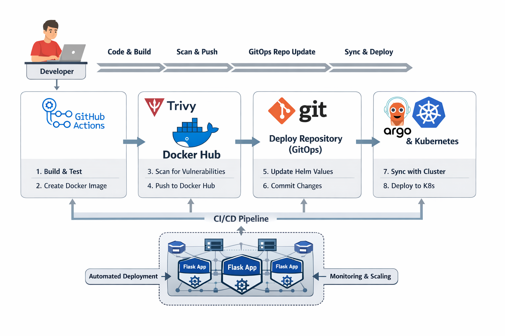

# 🚀 Flask CI Pipeline with GitHub Actions, Trivy, and Docker Hub

This project demonstrates a complete **Continuous Integration (CI)** pipeline for a Python Flask application using **GitHub Actions**, **Docker**, **Trivy**, and **Docker Hub**.

The pipeline automatically tests the application, builds a Docker image, scans it for vulnerabilities, and pushes the image to Docker Hub.





---

## 📌 Project Overview

This project focuses on the **CI phase** of the DevOps lifecycle.

Whenever code is pushed to the repository, GitHub Actions automatically runs the pipeline and performs the following steps:

1. Checkout the source code
2. Set up Python
3. Install dependencies
4. Run automated tests with Pytest
5. Build Docker image
6. Scan the image using Trivy
7. Push the image to Docker Hub
8. Update the deployment repository for GitOps-based CD

---

## 🧰 Technologies Used

* **Python / Flask** – Web application
* **Pytest** – Testing framework
* **GitHub Actions** – CI automation
* **Docker** – Containerization
* **Trivy** – Container vulnerability scanning
* **Docker Hub** – Image registry
* **GitHub** – Source code hosting

---

## 📁 Project Structure

```text
flask-trivy-actions/
├── app/
│   ├── __init__.py
│   └── routes.py
├── tests/
│   └── test_routes.py
├── requirements.txt
├── requirements-dev.txt
├── run.py
├── Dockerfile
└── .github/
    └── workflows/
        └── ci.yml
```

---

## ⚙️ CI Workflow

The GitHub Actions workflow is triggered on every push to the `main` branch.

### CI Steps

### 1. Checkout Code

The pipeline pulls the latest source code from GitHub.

### 2. Set Up Python

A Python runtime is installed for the workflow.

### 3. Install Dependencies

Development dependencies are installed from `requirements-dev.txt`.

### 4. Run Tests

Pytest runs the test suite to verify the application works correctly.

```bash
pytest tests
```

### 5. Build Docker Image

Docker builds the application image.

```bash
docker build -t ahmad09x/python-flask-app:<tag> .
```

### 6. Scan Docker Image with Trivy

Trivy scans the built image for security vulnerabilities.

The pipeline is configured to fail if **HIGH** or **CRITICAL** vulnerabilities are found.

### 7. Push Image to Docker Hub

If all tests and security checks pass, the image is pushed to Docker Hub.

Example tags:

* `ahmad09x/python-flask-app:20f2ab9`
* `ahmad09x/python-flask-app:latest`

### 8. Update Deploy Repository

After pushing the image, the workflow updates the deployment repository with the new image tag so that a GitOps tool like Argo CD can deploy it.

---

## 🐳 Docker Hub Repository

The built images are stored in Docker Hub:

```text
ahmad09x/python-flask-app
``

---

## 🔐 Security with Trivy

Trivy is used as part of the CI pipeline to scan the Docker image before it is pushed.

This helps ensure:

* vulnerabilities are detected early
* insecure images are blocked
* container security becomes part of the CI workflow

---

## ✅ Key Features

* Automated CI pipeline
* Automated testing with Pytest
* Docker image build
* Trivy image scanning
* Docker Hub integration
* GitHub Actions workflow
* GitOps-ready deployment update

---

## 🧪 Example Workflow

1. Developer updates the Flask app
2. Code is pushed to GitHub
3. GitHub Actions starts automatically
4. Tests are executed
5. Docker image is built
6. Trivy scans the image
7. Image is pushed to Docker Hub
8. Deployment repo is updated with the new image tag

---

## 📌 Notes

* This repository handles **CI only**
* Deployment is handled separately through a GitOps workflow
* The deployment repository can be watched by **Argo CD**
* The CI pipeline ensures only tested and scanned images are published

---

## 👨‍💻 Author

**Ahmad Alabrash**

---

## ⭐ Conclusion

This project demonstrates a modern CI workflow for a Flask application using GitHub Actions, Trivy, and Docker Hub.

It provides a strong foundation for secure container-based deployment and integrates cleanly with GitOps tools such as Argo CD.
